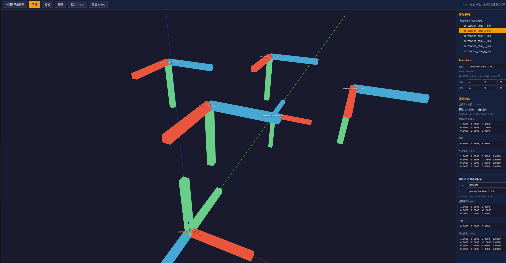

# Robot Frame Viz

机器人坐标系可视化与标定工具。在 3D 场景中搭建坐标系树，交互式调整位姿，实时查看外参矩阵，并导出 YAML 标定结果。

## 功能

- **坐标系树**：以 `baselink` 为根节点，支持多级子坐标系
- **3D 交互**：平移 / 旋转 gizmo，点击选中，Shift+拖拽快速创建子坐标系
- **数值编辑**：侧边栏直接输入 xyz 位置与 RPY 角度
- **外参矩阵**：查看 baselink → 当前选中、或任意两坐标系之间的 R、t、T
- **YAML 导出**：保存坐标系结构关系及相对外参（旋转矩阵 + xyz/rpy）



## 坐标约定

| 项目 | 说明 |
|------|------|
| 坐标系方向 | Z 轴朝上 (Z-up) |
| 位置单位 | 米 (m) |
| RPY 约定 | intrinsic XYZ (Roll-Pitch-Yaw)，单位为度 |
| 外参含义 | 子坐标系相对父坐标系的变换 |

## 快速开始

```bash
npm install
npm run dev        # 开发，默认 http://localhost:5173
npm run build      # 生产构建，输出到 dist/
npm run preview    # 预览构建结果
```

## 操作说明

| 操作 | 方式 |
|------|------|
| 选中坐标系 | 点击 3D 场景中的坐标轴或左侧树节点 |
| 平移 / 旋转 | 工具栏切换模式，拖拽 gizmo |
| 新建子坐标系 | 工具栏「+ 新建子坐标系」，或 Shift+左键拖拽 |
| 删除 | 选中后点击「删除」（baselink 不可删） |
| 导出 | 工具栏「导出 YAML」 |

## 导出格式

导出文件 `frames.yaml` 包含两部分：

**structure** — 坐标系父子关系

```yaml
structure:
  baselink:
    parent: null
    children: [camera_link]
  camera_link:
    parent: baselink
    children: []
```

**extrinsics** — 各子坐标系相对父坐标系的外参

```yaml
extrinsics:
  camera_link:
    parent: baselink
    xyz: [0.01, 0.0, 0.05]       # 相对父坐标系平移 (m)
    rpy: [0.0, 0.0, 90.0]        # 相对父坐标系旋转 (deg)
    R:                            # 3×3 旋转矩阵
      - [0.0, -1.0, 0.0]
      - [1.0, 0.0, 0.0]
      - [0.0, 0.0, 1.0]
    t: [0.01, 0.0, 0.05]         # 平移向量
```

## 技术栈

- React 19 + TypeScript
- Three.js / React Three Fiber / Drei
- Zustand（状态管理）
- Vite（构建）

## 项目结构

```
src/
├── components/       # UI 与 3D 组件
├── math/             # 变换计算与 YAML 导出
├── store/            # 坐标系状态
└── types/            # 类型定义
```
